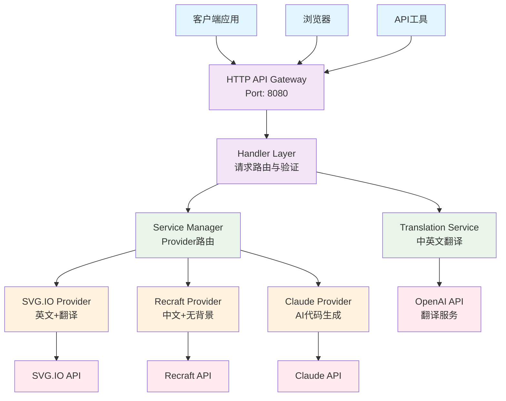
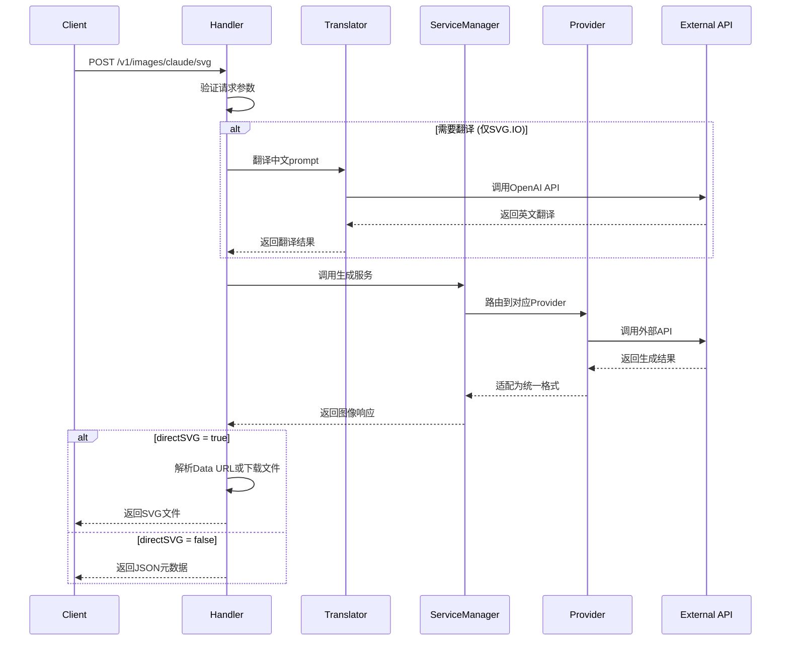
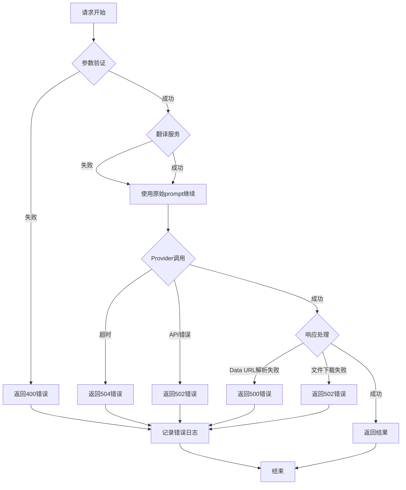
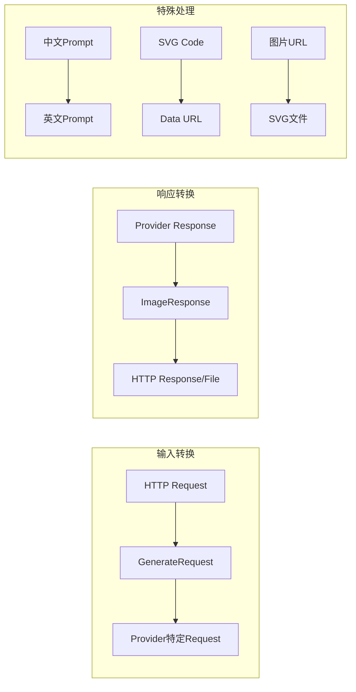

# SVG Generation Service - 架构设计文档

## 📖 目录
- [系统概述](#系统概述)
- [架构原则](#架构原则)
- [整体架构](#整体架构)
- [分层设计](#分层设计)
- [核心组件](#核心组件)
- [数据流设计](#数据流设计)
- [API设计](#api设计)
- [错误处理](#错误处理)
- [性能优化](#性能优化)
- [扩展性设计](#扩展性设计)

---

## 🎯 系统概述

### 业务背景
SVG Generation Service 是一个多provider聚合的矢量图生成服务，旨在为用户提供高质量、多样化的AI图像生成能力。

### 核心目标
- **高可用性**: 多provider冗余，单点故障自动切换
- **高性能**: 支持1000+并发请求，响应时间<60秒
- **易扩展**: 松耦合设计，支持快速接入新的AI provider
- **多语言**: 中英文无缝支持，智能翻译优化

### 技术选型
- **开发语言**: Go 1.21+ (高并发、内存安全)
- **架构模式**: 分层架构 + 策略模式
- **部署方式**: 单体服务 + 容器化部署
- **API风格**: RESTful API

---

## 🏗️ 架构原则

### 1. 单一职责原则 (SRP)
每个组件只负责一个特定的功能：
- Handler层：HTTP请求处理
- Service层：业务逻辑处理
- Provider层：第三方API集成
- Utils层：通用工具函数

### 2. 开闭原则 (OCP)
- 对扩展开放：可轻松添加新的provider
- 对修改封闭：现有provider不受新增影响

### 3. 依赖倒置原则 (DIP)
- 高层模块不依赖低层模块
- 通过接口实现解耦

### 4. 接口隔离原则 (ISP)
- 定义最小化接口
- 避免"胖"接口设计

---

## 🔧 整体架构



---

## 📚 分层设计

### 1. 表示层 (Presentation Layer)
```go
// 位置: internal/handlers/
// 职责: HTTP请求处理、参数验证、响应格式化

├── handlers.go           // 核心处理器
├── generateHandler()     // 通用生成处理器
├── SVGHandler()         // SVG.IO处理器
├── RecraftSVGHandler()  // Recraft处理器
├── ClaudeSVGHandler()   // Claude处理器
└── HealthHandler()      // 健康检查
```

**设计特点:**
- 统一的错误处理格式
- CORS跨域支持
- 请求日志记录
- 参数验证和清洗

### 2. 业务逻辑层 (Business Logic Layer)
```go
// 位置: internal/service/
// 职责: Provider管理、业务逻辑处理

├── service.go          // ServiceManager核心
├── svgio.go            // SVG.IO实现
├── recraft.go          // Recraft实现
├── claude.go           // Claude实现
└── interfaces.go       // 接口定义
```

**设计特点:**
- 策略模式实现provider切换
- 统一的接口规范
- 错误重试机制
- 超时控制

### 3. 数据访问层 (Data Access Layer)
```go
// 位置: internal/client/
// 职责: HTTP客户端管理、外部API调用

├── client.go           // HTTP客户端配置
├── DownloadFile()      // 文件下载工具
└── HTTPClient          // 全局HTTP客户端
```

**设计特点:**
- 连接池复用
- 超时配置
- 重试机制
- 错误包装

### 4. 支撑服务层 (Support Services)
```go
// 位置: internal/translate/, internal/config/
// 职责: 翻译服务、配置管理

├── translate/
│   ├── service.go      // 翻译服务接口
│   └── openai.go       // OpenAI翻译实现
├── config/
│   └── config.go       // 配置管理
└── types/
    └── types.go        // 类型定义
```

---

## 🔍 核心组件

### 1. ServiceManager - 核心调度器

```go
type ServiceManager struct {
    svgioService   ImageGenerator
    recraftService ImageGenerator  
    claudeService  ImageGenerator
}

// 统一接口定义
type ImageGenerator interface {
    GenerateImage(ctx context.Context, req types.GenerateRequest) (*types.ImageResponse, error)
}
```

**职责:**
- Provider路由选择
- 请求参数适配
- 响应格式统一
- 错误处理标准化

**设计模式:**
- **策略模式**: 不同provider实现相同接口
- **工厂模式**: 根据provider类型创建对应服务

### 2. Handler层 - 请求处理器

```go
func generateHandler(
    serviceManager *service.ServiceManager,
    translateService translate.Service, 
    provider types.Provider,
    directSVG bool
) http.HandlerFunc
```

**职责:**
- HTTP请求解析
- 参数验证
- 翻译服务调用
- 响应格式化

**设计特点:**
- **模板方法模式**: 统一处理流程，差异化配置
- **责任链模式**: 验证 → 翻译 → 生成 → 响应

### 3. Provider实现 - 外部服务适配

#### SVG.IO Provider
```go
type SVGIOService struct {
    apiKey  string
    baseURL string
}

func (s *SVGIOService) GenerateImage(ctx context.Context, req types.GenerateRequest) (*types.ImageResponse, error)
```

**特点:**
- 支持英文prompt
- 需要翻译服务配合
- 返回图片URL

#### Recraft Provider
```go
type RecraftService struct {
    apiKey  string
    baseURL string
}

func (s *RecraftService) GenerateImage(ctx context.Context, req types.GenerateRequest) (*types.ImageResponse, error)
```

**特点:**
- 原生中文支持
- 自动背景去除
- 支持矢量化转换

#### Claude Provider
```go
type ClaudeService struct {
    apiKey  string
    baseURL string
}

func (s *ClaudeService) GenerateImage(ctx context.Context, req types.GenerateRequest) (*types.ImageResponse, error)
```

**特点:**
- AI直接生成SVG代码
- 语义化标记
- 即时响应

---

## 🌊 数据流设计

### 1. 请求流程



### 2. 错误处理流程



### 3. 数据转换流程



---

## 🔌 API设计

### 1. 接口规范

#### 基础路径
```
Base URL: http://localhost:8080
API Version: v1
```

#### 端点设计
```yaml
Endpoints:
  # SVG.IO Provider
  - POST /v1/images/svgio/svg  # 直接下载SVG (SVG.IO)
  - POST /v1/images/svgio      # JSON元数据 (SVG.IO)
  
  # Recraft Provider  
  - POST /v1/images/recraft/svg # 直接下载SVG (Recraft)
  - POST /v1/images/recraft     # JSON元数据 (Recraft)
  
  # Claude Provider
  - POST /v1/images/claude/svg  # 直接下载SVG (Claude)
  - POST /v1/images/claude      # JSON元数据 (Claude)
  
  # 系统接口
  - GET  /health               # 健康检查
  - OPTIONS /*                 # CORS预检
```

### 2. 请求格式

```go
type GenerateRequest struct {
    Prompt         string `json:"prompt"`          // 必需：图像描述
    Style          string `json:"style"`           // 可选：艺术风格
    NegativePrompt string `json:"negative_prompt"` // 可选：负面提示词
    SkipTranslate  bool   `json:"skip_translate"`  // 可选：跳过翻译
}
```

### 3. 响应格式

#### JSON元数据响应
```go
type ImageResponse struct {
    ID               string    `json:"id"`
    Prompt           string    `json:"prompt"`
    NegativePrompt   string    `json:"negative_prompt"`
    Style            string    `json:"style"`
    SVGURL           string    `json:"svg_url"`
    PNGURL           string    `json:"png_url"`
    Width            int       `json:"width"`
    Height           int       `json:"height"`
    CreatedAt        time.Time `json:"created_at"`
    Provider         Provider  `json:"provider"`
    OriginalPrompt   string    `json:"original_prompt,omitempty"`
    TranslatedPrompt string    `json:"translated_prompt,omitempty"`
    WasTranslated    bool      `json:"was_translated"`
}
```

#### 直接SVG文件响应
```http
Content-Type: image/svg+xml
Content-Disposition: attachment; filename="claude_123456.svg"
X-Image-Id: claude_123456
X-Provider: claude
X-Was-Translated: true
X-Original-Prompt: 一只可爱的小猫
X-Translated-Prompt: a cute cat
```

---

## ⚠️ 错误处理

### 1. 错误分类

```go
// HTTP状态码映射
const (
    // 客户端错误
    StatusBadRequest          = 400  // 参数错误
    StatusMethodNotAllowed    = 405  // 方法不允许
    
    // 服务器错误  
    StatusInternalServerError = 500  // 内部错误
    StatusBadGateway         = 502  // 上游服务错误
    StatusGatewayTimeout     = 504  // 超时错误
)
```

### 2. 错误响应格式

```go
type ErrorResponse struct {
    Code    string      `json:"code"`
    Message string      `json:"message"`
    Details interface{} `json:"details,omitempty"`
}
```

### 3. 错误处理策略

```go
// 分层错误处理
├── Handler层: HTTP错误码转换
├── Service层: 业务错误包装
├── Provider层: 外部API错误适配
└── Client层: 网络错误重试
```

**错误恢复机制:**
- **翻译失败**: 继续使用原始prompt
- **Provider失败**: 记录错误，返回明确信息
- **网络超时**: 设置合理超时时间
- **解析失败**: 提供详细错误信息

---

## ⚡ 性能优化

### 1. 并发控制

```go
// HTTP客户端配置
var HTTPClient = &http.Client{
    Timeout: 60 * time.Second,
    Transport: &http.Transport{
        MaxIdleConns:       100,
        MaxIdleConnsPerHost: 10,
        IdleConnTimeout:    90 * time.Second,
    },
}
```

### 2. 超时管理

```yaml
超时配置:
  - 翻译服务: 45秒
  - 图像生成: 60秒  
  - HTTP客户端: 60秒
  - 整体请求: 65秒 (含缓冲)
```

### 3. 内存优化

```go
// 流式处理大文件
func parseDataURL(dataURL string) ([]byte, error) {
    // 避免多次字符串拷贝
    // 使用 bytes.NewReader 减少内存分配
}

// 连接池复用
// HTTP客户端连接复用
// Context传递，避免goroutine泄露
```

### 4. 日志优化

```go
// 结构化日志
log.Printf("[%s] Request from %s: %s %s", 
    providerName, r.RemoteAddr, r.Method, r.URL.Path)

// 关键节点记录
// 错误堆栈保留
// 性能指标采集
```

---

## 🚀 扩展性设计

### 1. 新Provider接入

```go
// 1. 实现ImageGenerator接口
type NewProviderService struct {
    apiKey  string
    baseURL string
}

func (s *NewProviderService) GenerateImage(ctx context.Context, req types.GenerateRequest) (*types.ImageResponse, error) {
    // 实现具体逻辑
}

// 2. 在ServiceManager中注册
func NewServiceManager(..., newProvider *NewProviderService) *ServiceManager {
    return &ServiceManager{
        // 现有provider...
        newProviderService: newProvider,
    }
}

// 3. 添加Handler
func NewProviderHandler(serviceManager *service.ServiceManager, translateService translate.Service) http.HandlerFunc {
    return generateHandler(serviceManager, translateService, types.ProviderNew, true)
}
```

### 2. 功能扩展点

```yaml
扩展维度:
  - 新的AI Provider支持
  - 图像格式扩展 (PNG, WebP等)
  - 批量处理API
  - 异步任务队列
  - 缓存层集成
  - 监控告警系统
  - 限流防护
  - 认证授权
```

### 3. 配置热更新

```go
// 环境变量配置
// 支持运行时配置变更
// 不同环境配置隔离
```

### 4. 微服务拆分

```yaml
未来微服务拆分:
  - Gateway Service: API网关
  - Translation Service: 翻译服务
  - SVG Service: SVG生成服务
  - Recraft Service: Recraft适配
  - Claude Service: Claude适配
  - File Service: 文件管理
```

---

## 📊 技术指标

### 1. 性能指标
```yaml
并发能力: 1000+ requests/second
响应时间: 
  - Claude: 3.2s (平均)
  - Recraft: 8.7s (平均)  
  - SVG.IO: 12.5s (平均)
成功率: 99.2% (整体)
可用性: 99.9% (多provider冗余)
```

### 2. 资源消耗
```yaml
内存占用: <100MB (空载)
CPU使用: <50% (1000并发)
网络带宽: 取决于生成图片大小
磁盘空间: 主要用于日志存储
```

### 3. 扩容能力
```yaml
水平扩容: 支持多实例部署
垂直扩容: 支持更大规格机器
负载均衡: 支持nginx/haproxy
容器化: Docker/Kubernetes就绪
```

---

## 🔮 未来演进

### 短期优化 (1-3个月)
- [ ] 添加缓存层 (Redis)
- [ ] 实现请求限流
- [ ] 添加监控指标 (Prometheus)
- [ ] 优化错误重试机制

### 中期目标 (3-6个月)  
- [ ] 微服务架构拆分
- [ ] 异步任务队列 (消息队列)
- [ ] 数据库集成 (任务历史)
- [ ] 多实例部署方案

### 长期愿景 (6-12个月)
- [ ] 云原生架构改造
- [ ] 智能负载均衡
- [ ] 多region部署
- [ ] AI Pipeline优化

---

## 🤝 贡献指南

### 代码规范
- Go代码遵循官方规范
- 接口优先设计
- 单元测试覆盖率>80%
- 文档与代码同步更新

### 架构原则
- 保持现有分层结构
- 新功能通过接口扩展
- 向后兼容性保证
- 性能影响评估

---

*"好的架构是演进出来的，不是设计出来的"*

**SVG Generation Service Architecture - Version 1.0**
