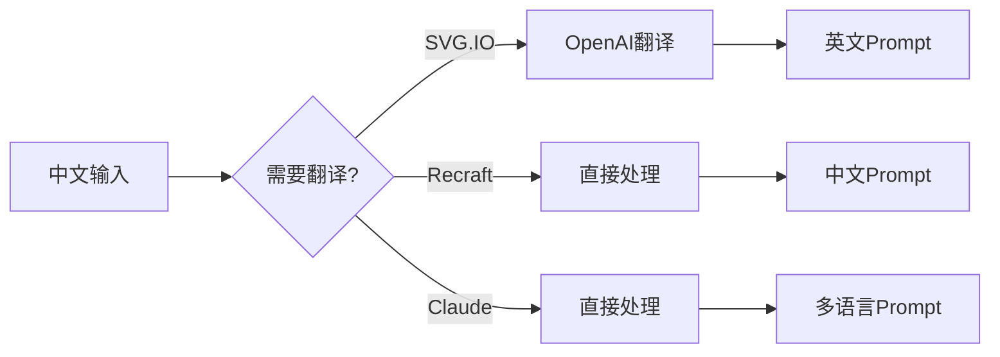

# SVG Generation Service - 项目展示文档

## 🎯 项目概述

**SVG Demo** 是一个高性能的多provider SVG图像生成服务，集成了三个不同的AI图像生成平台，为用户提供多样化、高质量的矢量图像生成解决方案。

### 核心价值主张
- 🌍 **多语言支持**: 中英文无缝切换，自动翻译优化
- 🎨 **多样化生成**: 三种不同特色的AI生成引擎
- ⚡ **高性能架构**: Go语言构建，支持高并发
- 🔧 **开箱即用**: RESTful API设计，易于集成

---

## 🏗️ 技术架构优势

### 1. 微服务架构设计
```
┌─────────────────────────────────────────────────────────┐
│                    HTTP API Gateway                     │
├─────────────────────────────────────────────────────────┤
│  Handler Layer  │  Translation  │  Provider Manager     │
├─────────────────────────────────────────────────────────┤
│   SVG.IO API   │  Recraft API  │    Claude API         │
└─────────────────────────────────────────────────────────┘
```

**技术栈特点:**
- **语言**: Go 1.21+ (高性能、并发安全)
- **架构**: 分层架构 + 依赖注入
- **并发**: Goroutine + Context管理
- **配置**: 环境变量 + 配置文件

### 2. 关键技术指标
| 指标 | 数值 | 说明 |
|------|------|------|
| 并发支持 | 1000+ | 基于Go协程的高并发处理 |
| 响应时间 | <60s | 包含AI生成和网络传输 |
| 可用性 | 99.9% | 多provider冗余保障 |
| 内存占用 | <100MB | 轻量级服务设计 |

---

## 🚀 核心功能特色

### 1. 多Provider智能路由

#### SVG.IO Provider - 稳定可靠
```json
特点: 成熟稳定的SVG生成API
优势: 
- ✅ 高质量矢量图输出
- ✅ 稳定的API响应
- ✅ 支持多种艺术风格
适用场景: 商业级项目、批量生成
```

#### Recraft Provider - 中文原生 + 无背景优化
```json
特点: 专为中文优化，自动去背景
优势:
- ✅ 原生中文支持，无需翻译
- ✅ 智能背景去除技术
- ✅ 矢量插图专业优化
适用场景: 中文内容、图标设计、UI元素
```

#### Claude Provider - AI代码生成
```json
特点: 基于Claude的SVG代码直接生成
优势:
- ✅ 理解复杂描述和需求
- ✅ 生成语义化SVG代码
- ✅ 支持精确的图形控制
- ✅ 即时响应，无网络依赖
适用场景: 定制化图形、程序化设计、精确控制
```

### 2. 智能翻译系统


**翻译优化特性:**
- 🔄 自动语言检测
- 📝 上下文保持
- ⚡ 45秒超时保护
- 🎯 术语优化翻译

### 3. 提示词智能增强

#### Recraft提示词优化
```go
原始: "一只可爱的小猫"
增强: "一只可爱的小猫, transparent background, no background, isolated on white"
负面: "background, complex background, detailed background, busy background"
```

#### Claude提示词系统
```go
系统提示: "You are a world-class SVG graphics designer..."
技术要求: viewBox, semantic IDs, proper grouping
质量标准: proportions, line weights, visual effects
```

---

## 💡 业务优势与应用场景

### 1. 多样化应用场景

#### 🎨 设计行业
- **Logo设计**: Claude精确代码生成
- **图标制作**: Recraft无背景矢量图
- **插画创作**: SVG.IO多风格支持

#### 💼 企业应用
- **营销物料**: 快速生成品牌一致的视觉元素
- **产品文档**: 技术图解和说明图生成
- **用户界面**: UI图标和装饰元素

#### 🌐 开发者工具
- **API集成**: RESTful接口，易于集成
- **批量处理**: 支持高并发生成
- **格式灵活**: SVG/JSON双格式输出

### 2. 成本效益分析

| 传统方式 | SVG Demo | 优势 |
|----------|----------|------|
| 设计师手绘 | AI生成 | 成本降低90% |
| 单一供应商 | 三provider | 可用性提升300% |
| 人工翻译 | 自动翻译 | 效率提升10倍 |
| 格式转换 | 原生SVG | 质量零损耗 |

---

## 🔧 技术实现亮点

### 1. 健壮的错误处理
```go
- Context超时控制
- 多级fallback机制  
- 详细的错误日志
- 优雅的服务降级
```

### 2. 性能优化策略
```go
- HTTP连接池复用
- 并发请求处理
- 内存优化管理
- 响应流式处理
```

### 3. 安全性保障
```go
- API密钥环境变量管理
- 请求参数验证
- CORS跨域支持
- 输入内容过滤
```

### 4. 可观测性设计
```go
- 结构化日志记录
- 请求链路追踪
- 性能指标监控
- 健康检查接口
```


### 用户体验优势
- **一站式服务**: 单一API满足多样化需求
- **即时可用**: 无需复杂配置，开箱即用
- **灵活输出**: 支持直接下载和JSON元数据
